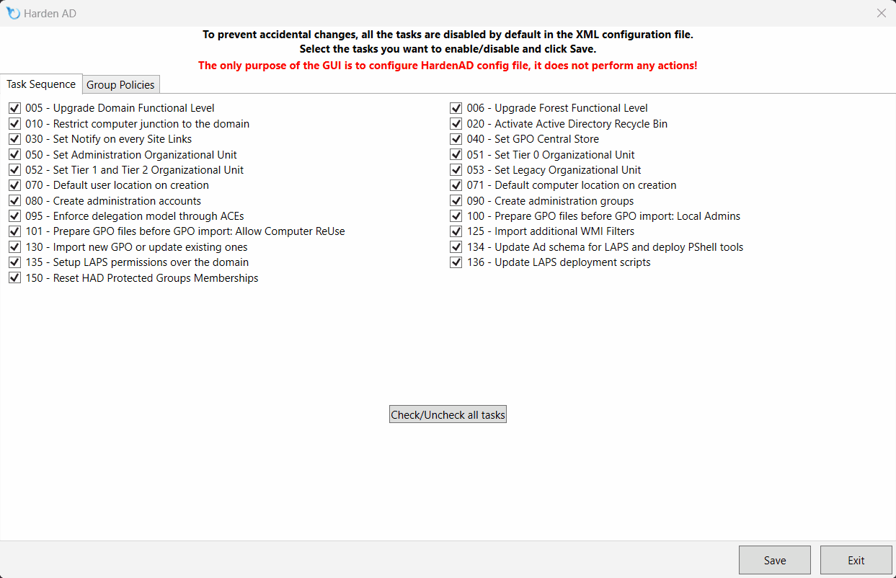

This is the version 2 of the Hardening Active Directory project by then Harden Community. 
Feel free to use it and adapt following your needs!

# DISCLAIMER
**ALL TASKS ARE DISABLED BY DEFAULT!**      
This is the way we ensure the script will not be run into production and make unwanted changes. Please refer to the welcome page of the latest release to learn how you can activate them.

## Just a word...
Welcome to our GitHub Repo dedicated to enhance the security of Active Directory. We both believe in a world were knowledge have to be shared, especialy when we are talking of protecting companies against cyber attacks. Our IT journey drove us to many situation in which we had to harden an existing directory hierarchy, most oftenly lacking of a security posture due to a lack of technical knowledge or usefull guidance.

This script is intended to assist you in setting-up a hardened directory, based on a strategy derivated from the Microsoft's red-forest model (also known as ESEA). 

## Documentation...
You can review our documentation here:
> Administrator Guide: https://hardenad.net/wp-content/uploads/2022/12/Harden-AD-2.9-User-Manual.pdf
> Quick Setup for lazy guys: https://hardenad.net/wp-content/uploads/2023/03/Harden-AD-2.9-deploiement-et-personnalisation-du-modele.pdf
> AD Security Training Simplified: https://hardenad.net/wp-content/uploads/2022/08/Harden-AD-formation-AD-cybsersecurite.pdf

## Some videos (French speaks)
When Guillaume demonstrate Harden AD: https://www.linkedin.com/events/7132717233872474112/comments/

## Configuration with GUI
To prevent accidental changes, all the tasks are disabled by default in the XML configuration file.
To help you to configure this XML file, you can use the GUI.
Please note the only purpose of the GUI is to configure HardenAD config file, it does not perform any actions!

To run the GUI, you have two options:
- run `./HardenAD.ps1 -GUI`
- run `Run-HardenADGui.ps1`

## Credit to ... Well. All those mails, tchat threads, ...

